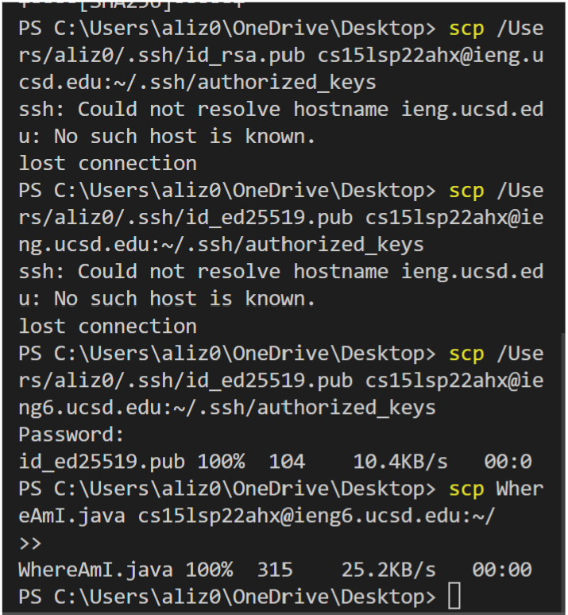

# **Ali's CSE15L Lab Report**
## The Github Blogpost  

This blog post is to help you (and potentially me) gain the fundamental skills when it comes to controlling remote servers and operating on them.  


### **1.Setting up VSCode**
* download VSCode by visiting the following [link](https://code.visualstudio.com/)
* choose the optimal version of VSCode based on your PC's environment.
* Once it is downloaded, open VSCode; you should have it looking similar to the picture below:  
  

### **2.Gaining Access to a Remote Server**
* Install _OpenSSH_ on your computer
* Once installed, open a terminal in VSCode (using the tab called Terminal above) and type the following:  
`ssh username@hostnamne`  
**_username@hostname_ will be replaced with the exact name of your remote server provided by your course instructor**
* Interestingly enough the following message will appear:

>⤇ ssh cs15lsp22zz@ieng6.ucsd.edu
The authenticity of host 'ieng6.ucsd.edu (128.54.70.227)' can't be established.
RSA key fingerprint is SHA256:ksruYwhnYH+sySHnHAtLUHngrPEyZTDl/1x99wUQcec.
Are you sure you want to continue connecting (yes/no/[fingerprint])?

* type yes and then provide the password after pressing enter; the terminal should look like so:
  
---
### **3.Trying Commands on the Remote Server**
* Remote servers use Unix commands; provided below is a list of some Unix commands and their meanings:<br>
    1. `pwd`: prints working directory of the server  
    2. `cp` : copies files  
    3. `cd` : changes directory to the one the users designates  
    4. `mkdir` : creates a new directory under the name the user specifies  
    5. `rm` : removes the files the user specifies
    6. `mv` : move files or rename them (depending on the arguments) 
    7. `ls` : Usually used with additional shortcuts, they list the files available 
* Here is a demonstration of the commands being used shown below:  

---
### **4.Copying files into Remote Server**
* files from the _client server_ (your PC) can be copied into the remote server(& even compiled and run there)
```
scp filename user@hostname
```
**where filename is the name of the file you want to copy into the remote server (user@hostname)**  
* Provide the password and the file will be in the remote server, ready to be used.
---
### **5.Setting up SSH Key**
* Setting up the SSH Key helps in gaining acces to the remote server as well as copy files into there without the need for a password  
* on the client server, do the following:
1. `ssh-keygen`  
    the following message will appear:
>Generating public/private rsa key pair.
Enter file in which to save the key (/Users/<user-name>/.ssh/id_rsa): /Users/<user-name>/.ssh/id_rsa   

 2.  provide the terminal with a directory to save the key(use the one in brackets). The following will apear  

 > Enter passphrase(empty for no passphrase): 

**Provide no passphrase**
> Enter same passphrase again:   

**Provide no passphrase**  
3. the following image will then appear:  

  

 then do the following:
 >`$ ssh cs15lsp22zz@ieng6.ucsd.edu`  

Enter Password  
After entering your password create a directory  

`$ mkdir .ssh`    
Then log out to copy the keys into the remote server (new directory)  
`$ logout`  

`$ scp /Users/<user-name>/.ssh/id_rsa.pub cs15lsp22zz@ieng6.ucsd.edu:~/.ssh/authorized_keys`  
* In the end, the terminal will be capable of doing things similar to the picture below:
  
---
### **6.Optimizing Work on Remote Server**
* Based on the knowledge we have, we can create a more optimal work flow when working at theh remote server 
**in this example, we will use a java file
1. Create a key (using key gen) to remove the need to use a password when dealing with remote access or copying files.  
2. Copy file into remote server using the following:
```
scp filename1.java user@hostname
```
3. login into the remote server (use the *up-arrow key* to refer to past command- since we used it to create the key)
4. Compound the run the following:
```
cp filename1.java filename2.java; javac filename2.java; java filename2
```
* This is how the end product looks:

---
## **Wrap up**
This is the end of the blog post; I hope you foundit useful. **Happy Coding!**

